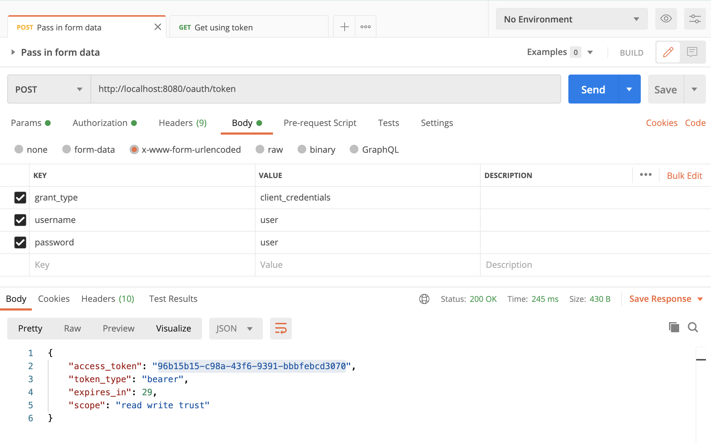
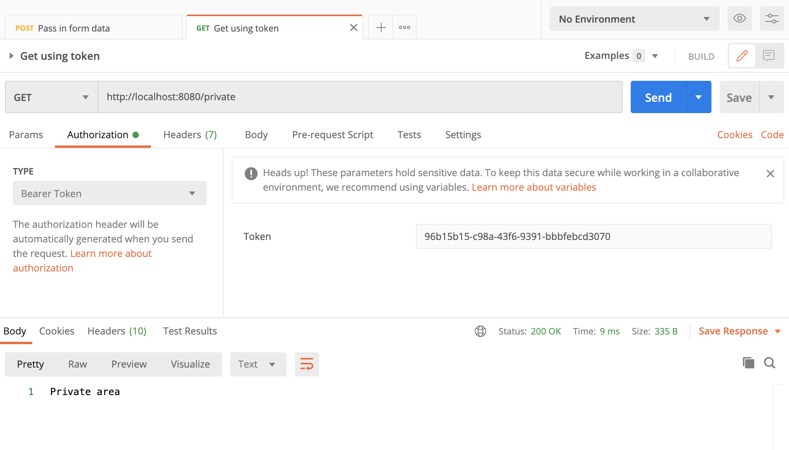

# Spring-oauth2-jpa-example
- Original Repository - https://github.com/arocketman/Spring-oauth2-jpa-example
- Changes - Java8 to Java11, Dependency Changes, Adding datasource in application.yml, Read clientId and clientSecret from application.yml
# How it works
1. Create Username: user and Password: user in memory once the application starts (VanillaApplication.java)
2. API to get token (it is supported by oauth2) - http://localhost:8080/oauth/token

3. Use generated token for further access
